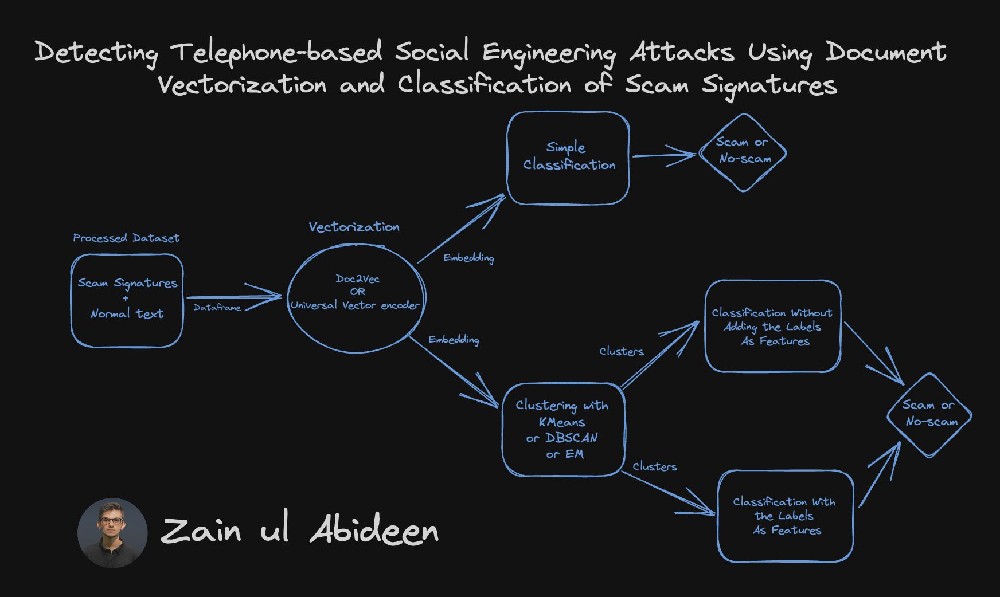
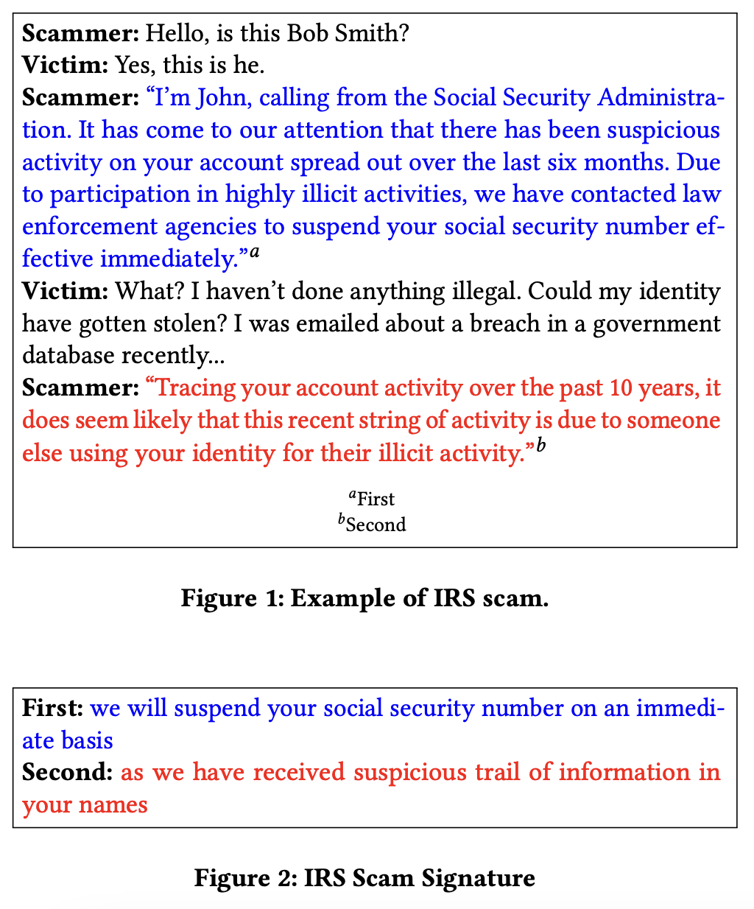
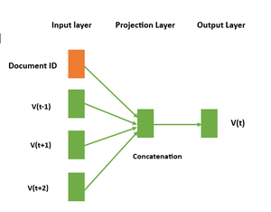
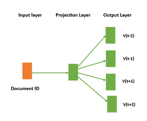
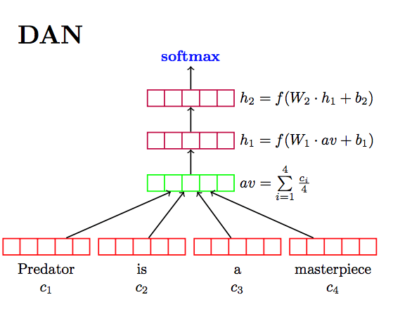
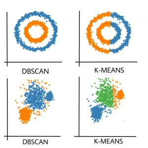

## Detecting Telephone-based Social Engineering Attacks Using Document Vectorization and Classification of Scam Signatures :phone: = :cl:
This repo contains the Scam Signature detection dataset and collection of various Vectorization, Clustering and Classification techniques to effectively detect telephone-based social engineering attacks. This repo uses a social engineering detection approach called the Anti-Social Engineering Tool (ASsET), which detects attacks based on the semantic content of the conversation. (:link: [Ali et al.](https://dl.acm.org/doi/pdf/10.1145/3445970.3451152)). <br/>

<p align="center">

</p>

It's aimed at exploring various ways to detect **Scam Signatures** about transformers. <br/>

## Table of Contents
  * [What are Telephone-based Social Engineering attacks?](#what-are-telephone-based-social-engineering-attacks)
  * [Understanding Document Vectorization](#understanding-vectorization)
  * [Clustering Techniques](#clustering-techniques)
  * [Classification Models](#classification-models)
  * [Setup](#setup)
  * [Todos](#todos)
  * [Acknowledgements](#acknowledgements)
  * [Citation](#citation)
  * [Connect with me](#connect-with-me)

## What-are-Telephone-based-Social-Engineering-attacks

Telephone-based social engineering attacks, also known as phone scams, are a form of cyber attack where malicious actors use the phone as a medium to manipulate individuals or organizations into revealing sensitive information, performing actions, or providing financial gains. These attacks rely on the art of persuasion, psychological manipulation, and impersonation to deceive and exploit victims. 

Each scam type is identified by a set of speech acts that are collectively referred to as a **Scam Signature**. We can define a scam signature as a set of utterances that perform speech acts that are collectively unique to a class of social engineering attacks. These utterances are the key points, fulfilling the goal of the scammer
for that attack. A scam signature uniquely identifies a class of social engineering attacks in the same way that a malware signature uniquely identifies a class of malware. I will use a social engineering detection approach called the **Anti-Social Engineering Tool (ASsET)**, which detects attacks based on the semantic content of the conversation.

<p align="center">

</p>

## Understanding Vectorization

In this repo, I have used two different methods for vectorization of scam signatures. First one is **Doc2Vec** and second is **Universal Sentence Encoder**.

**Doc2Vec** is a neural network-based approach that learns the distributed representation of documents. It is an unsupervised learning technique that maps each document to a fixed-length vector in a high-dimensional space. The vectors are learned in such a way that similar documents are mapped to nearby points in the vector space. This enables us to compare documents based on their vector representation and perform tasks such as document classification, clustering, and similarity analysis.

There are two main variants of the Doc2Vec approach: 

1) Distributed Memory (DM)
2) Distributed Bag of Words (DBOW)


➡️ Distributed Memory (DM)
Distributed Memory is a variant of the Doc2Vec model, which is an extension of the popular Word2Vec model. The basic idea behind Distributed Memory is to learn a fixed-length vector representation for each piece of text data (such as a sentence, paragraph, or document) by taking into account the context in which it appears. In the DM architecture, the neural network takes two types of inputs:  the context words and a unique document ID. The context words are used to predict a target word, and the document ID is used to capture the overall meaning of the document. The network has two main components:  the projection layer and the output layer.
The projection layer is responsible for creating the word vectors and document vectors. For each word in the input sequence, a unique word vector is created, and for each document, a unique document vector is created. These vectors are learned through the training process by optimizing a loss function that minimizes the difference between the predicted word and the actual target word. The output neural network takes the distributed representation of the context and predicts the target word.

<p align="center">

</p>


➡️ Distributed Bag of Words (DBOW): DBOW is a simpler version of the Doc2Vec algorithm that focuses on understanding how words are distributed in a text, rather than their meaning. This architecture is preferred when the goal is to analyze the structure of the text, rather than its content. In the DBOW architecture, a unique vector representation is assigned to each document in the corpus, but there are no separate word vectors.  Instead, the algorithm takes in a document and learns to predict the probability of each word in the document given only the document vector. The model does not take into account the order of the words in the document, treating the document as a collection or “bag ” of words. This makes the DBOW architecture faster to train than DM, but potentially less powerful in capturing the meaning of the documents.

<p align="center">

</p>

**Universal Sentence Encoder**

The Universal Sentence Encoder encodes text into high-dimensional vectors that can be used for text classification, semantic similarity, clustering and other natural language tasks.

The model is trained and optimized for greater-than-word length text, such as sentences, phrases or short paragraphs. It is trained on a variety of data sources and a variety of tasks with the aim of dynamically accommodating a wide variety of natural language understanding tasks. The input is variable length English text and the output is a 512 dimensional vector. The universal-sentence-encoder model is trained with a **Deep Averaging Network (DAN)** encoder.

<p align="center">

</p>


## Clustering Techniques

In this project, I have used three different clustering techniques: **K-MEANS**, **DB-SCAN** and **EM**. 

<p align="center">

</p>

**K-Means Clustering:**
K-Means is a popular unsupervised machine learning algorithm used for clustering data. It partitions a dataset into K distinct, non-overlapping clusters based on the similarity of data points. The algorithm works by iteratively assigning data points to the nearest cluster centroid and updating the centroids to minimize the within-cluster variance. K-Means is efficient and easy to implement but requires specifying the number of clusters (K) in advance, which can be a limitation.

**DBSCAN (Density-Based Spatial Clustering of Applications with Noise):**
DBSCAN is a density-based clustering algorithm that doesn't require specifying the number of clusters in advance. It identifies clusters as regions of high data point density separated by areas of lower density. DBSCAN groups data points that are close to each other into clusters and can also identify noise points that don't belong to any cluster. It's particularly useful for discovering clusters of arbitrary shapes and handling noisy data.

**EM (Expectation-Maximization) Clustering:**
EM is a statistical approach to clustering that models the data distribution as a mixture of several probability distributions. In EM clustering, it is assumed that data is generated from a mixture of Gaussian distributions. The algorithm iteratively estimates the parameters of these Gaussian distributions and assigns data points to the most likely component based on the estimated probabilities. EM clustering is capable of modeling clusters with different shapes and sizes and can handle situations where the clusters overlap.

**Comparison:**
Comparing the three techniques on the basis of cluster shape, size, noise, scalability and senstivity:

1) Cluster Shape: K-Means assumes clusters are spherical and equally sized. Struggles with non-spherical clusters. DBSCAN can identify clusters of arbitrary shapes. EM is capable of modeling clusters with different shapes.

2) Number of Clusters: K-Means requires specifying the number of clusters (K) in advance. DBSCAN automatically determines the number of clusters based on data density. EM requires specifying the number of components (clusters) in advance.

3) Handling Noise: K-Means is sensitive to outliers and can assign noise points to the nearest cluster. DBSCAN identifies noise points as outliers not belonging to any cluster. EM can handle noise to some extent but may assign noise points to a cluster if their likelihood is above a certain threshold.

4) Scalability: K-Means scales well to large datasets. DBSCAN can be computationally intensive for large datasets due to its density-based nature. EM is sensitive to the number of components and may not scale well for very large datasets.

5) Initialization Sensitivity: K-Meansis sensitive to the initial choice of centroids, may converge to suboptimal solutions. DBSCAN is not sensitive to initialization. EM is sensitive to initialization, can converge to different solutions based on the initial parameters.

## Classification Models

In this project I have used various classification models like Logistic regression, Random forest classifier, Xgboost, Catboost, and Gausian Naive Bayes.

[Learn More](https://www.geeksforgeeks.org/getting-started-with-classification/)


## Setup

So we talked about what telephone based social engineering attacks are, and what they can do for you (among other things). <br/>
Let's get this thing running! Follow the next steps:

1. `git clone https://github.com/abideenml/Detecting-SocialEngineering-Attacks`
2. Navigate into project directory `cd path_to_repo`
3. Create a new venv environment and run `pip install -r requirements.txt`
4. Run the `DocToVec_KMeans_+_EM_CLustering_Classifications_+_DBSCAN.ipynb` and `Universal_Vector_Encoding_KMeans_+_EM_+_DBSCAN_Clustering_Classifications.ipynb` file.

That's it! It should work out-of-the-box executing requirements.txt file which deals with dependencies. <br/>


## Todos:

Finally there are a couple more todos which I'll hopefully add really soon:
* Explore how open source LLMs can be used to detect these scams.
* Make a data pipeline with Kedro and MLflow.
* Deploy the models and learn the effect of drift on their performance.


## Acknowledgements

I found these resources useful (while developing this one):

* [Detecting Telephone-based Social Engineering Attacks using Scam Signatures](https://dl.acm.org/doi/pdf/10.1145/3445970.3451152)
* [Universal Sentence Encoder](https://huggingface.co/Dimitre/universal-sentence-encoder)
* [Doc2Vec](https://medium.com/wisio/a-gentle-introduction-to-doc2vec-db3e8c0cce5e)


## Citation

If you find this code useful, please cite the following:

```
@misc{Zain2023DetectingSocialEngineeringAttacks,
  author = {Zain, Abideen},
  title = {detect-social-engineering-attacks},
  year = {2023},
  publisher = {GitHub},
  journal = {GitHub repository},
  howpublished = {\url{https://github.com/abideenml/ResearchProjects/tree/master/Detecting-Telephone-based-Social-Engineering-Attacks}},
}
```

## Connect with me

If you'd love to have some more AI-related content in your life :nerd_face:, consider:

* Connect and reach me on [LinkedIn](https://www.linkedin.com/in/zaiinulabideen/) and [Twitter](https://twitter.com/zaynismm)
* Follow me on 📚 [Medium](https://medium.com/@zaiinn440)
* Subscribe to my 📢 weekly [AI newsletter](https://rethinkai.substack.com/)!

## Licence

[](https://github.com/abideenml/ResearchProjects/blob/master/LICENCE)